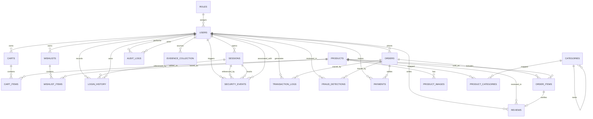

# Database

This folder contains the normalized MySQL data model for the secure e-commerce platform.

## Files

- [schema.sql](schema.sql) - Complete DDL with primary keys, foreign keys, and constraints.
- [seeds.sql](seeds.sql) - Seed data placeholder.
- [migrations](migrations) - Migration workspace placeholder.

## Relationship Summary

- A user belongs to one role.
- Products can belong to multiple categories through a junction table.
- Users own carts, wishlists, orders, sessions, login history, reviews, audit logs, and security events.
- Products own images and many-to-many category links.
- Orders contain many order items.
- Payments belong to orders and reference the paying user.
- Sessions are linked to users and can be referenced by login history and security events.
- Orders also carry tracking and invoice metadata for shipment follow-up and invoice generation.
- Transaction logs, fraud detections, and evidence collection support forensic investigation and incident response.

## ER Diagram

