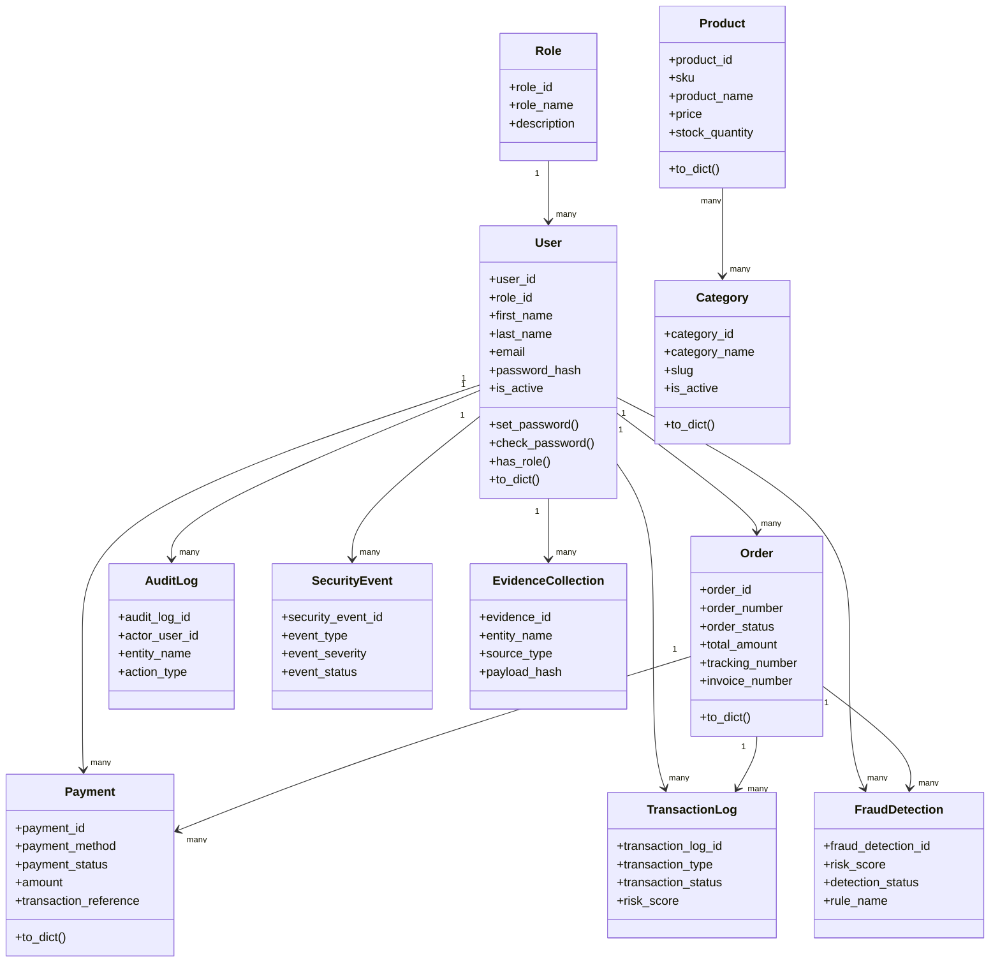

# Class Diagram

```mermaid
classDiagram
  class User {
    +user_id
    +role_id
    +first_name
    +last_name
    +email
    +password_hash
    +is_active
    +set_password()
    +check_password()
    +has_role()
    +to_dict()
  }

  class Role {
    +role_id
    +role_name
    +description
  }

  class Product {
    +product_id
    +sku
    +product_name
    +price
    +stock_quantity
    +to_dict()
  }

  class Category {
    +category_id
    +category_name
    +slug
    +is_active
    +to_dict()
  }

  class Order {
    +order_id
    +order_number
    +order_status
    +total_amount
    +tracking_number
    +invoice_number
    +to_dict()
  }

  class Payment {
    +payment_id
    +payment_method
    +payment_status
    +amount
    +transaction_reference
    +to_dict()
  }

  class AuditLog {
    +audit_log_id
    +actor_user_id
    +entity_name
    +action_type
  }

  class SecurityEvent {
    +security_event_id
    +event_type
    +event_severity
    +event_status
  }

  class TransactionLog {
    +transaction_log_id
    +transaction_type
    +transaction_status
    +risk_score
  }

  class FraudDetection {
    +fraud_detection_id
    +risk_score
    +detection_status
    +rule_name
  }

  class EvidenceCollection {
    +evidence_id
    +entity_name
    +source_type
    +payload_hash
  }

  Role "1" --> "many" User
  User "1" --> "many" Order
  User "1" --> "many" Payment
  User "1" --> "many" AuditLog
  User "1" --> "many" SecurityEvent
  User "1" --> "many" TransactionLog
  User "1" --> "many" FraudDetection
  User "1" --> "many" EvidenceCollection
  Product "many" --> "many" Category
  Order "1" --> "many" Payment
  Order "1" --> "many" TransactionLog
  Order "1" --> "many" FraudDetection
```
