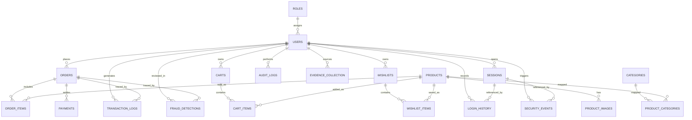

# Database Schema

The platform uses a normalized MySQL schema that groups data into identity, catalog, commerce, security, and forensic domains.

## Core Domains

- Identity: roles, users, sessions, login history.
- Catalog: categories, products, product images, and product-category mappings.
- Commerce: carts, cart items, wishlists, wishlist items, orders, order items, and payments.
- Security: audit logs and security events.
- Forensics: transaction logs, fraud detections, and evidence collection.

## Relationship Summary

- A role owns many users.
- A user can own carts, wishlists, orders, sessions, audit activity, security events, and forensic records.
- Products can belong to many categories.
- Carts and wishlists contain many products through item tables.
- Orders contain many order items and many payments.
- Payments belong to an order and reference the payer.
- Audit, security, transaction, fraud, and evidence tables support traceability and incident review.

## Key Tables

- `roles`
- `users`
- `sessions`
- `login_history`
- `categories`
- `products`
- `product_images`
- `carts`
- `cart_items`
- `wishlists`
- `wishlist_items`
- `orders`
- `order_items`
- `payments`
- `audit_logs`
- `security_events`
- `transaction_logs`
- `fraud_detections`
- `evidence_collection`

## ER Diagram

