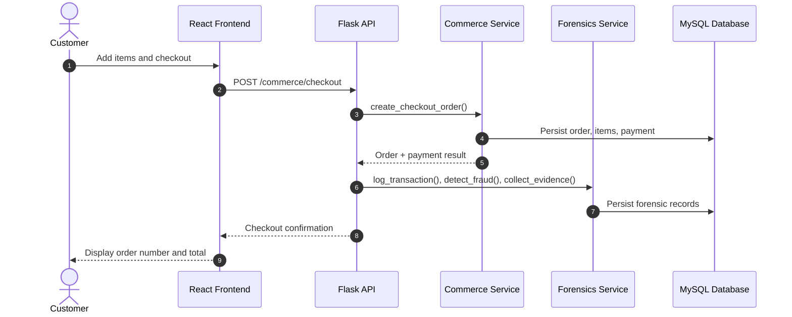

# Sequence Diagram

```mermaid
sequenceDiagram
  autonumber
  actor Customer
  participant Frontend as React Frontend
  participant API as Flask API
  participant Commerce as Commerce Service
  participant Forensics as Forensics Service
  participant DB as MySQL Database

  Customer->>Frontend: Add items and checkout
  Frontend->>API: POST /commerce/checkout
  API->>Commerce: create_checkout_order()
  Commerce->>DB: Persist order, items, payment
  Commerce-->>API: Order + payment result
  API->>Forensics: log_transaction(), detect_fraud(), collect_evidence()
  Forensics->>DB: Persist forensic records
  API-->>Frontend: Checkout confirmation
  Frontend-->>Customer: Display order number and total
```
