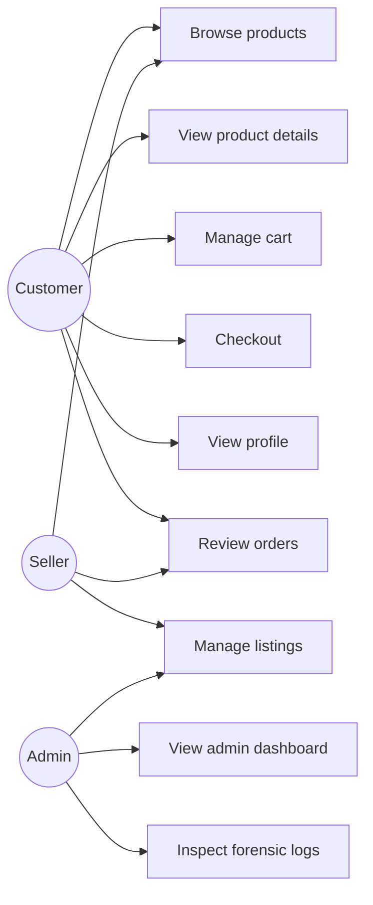

# Use Case Diagram

```mermaid
flowchart LR
  Customer((Customer))
  Seller((Seller))
  Admin((Admin))

  Browse[Browse products]
  Product[View product details]
  Cart[Manage cart]
  Checkout[Checkout]
  Profile[View profile]
  Orders[Review orders]
  Sell[Manage listings]
  AdminDash[View admin dashboard]
  Logs[Inspect forensic logs]

  Customer --> Browse
  Customer --> Product
  Customer --> Cart
  Customer --> Checkout
  Customer --> Profile
  Customer --> Orders

  Seller --> Browse
  Seller --> Sell
  Seller --> Orders

  Admin --> AdminDash
  Admin --> Logs
  Admin --> Sell
```
